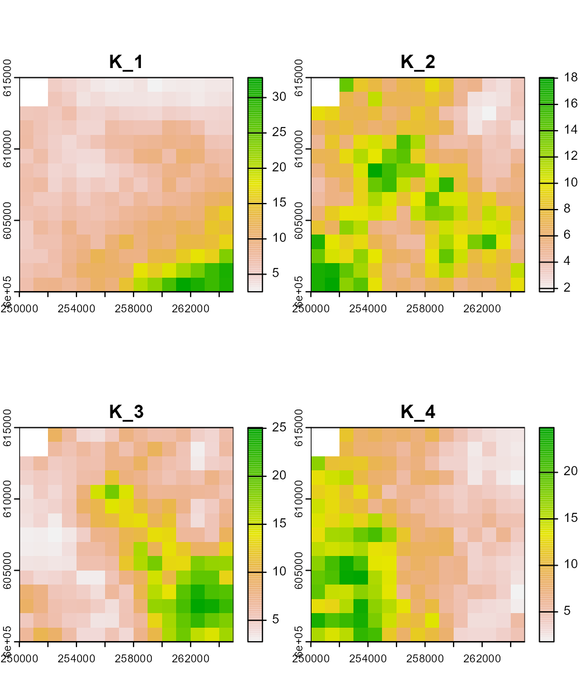
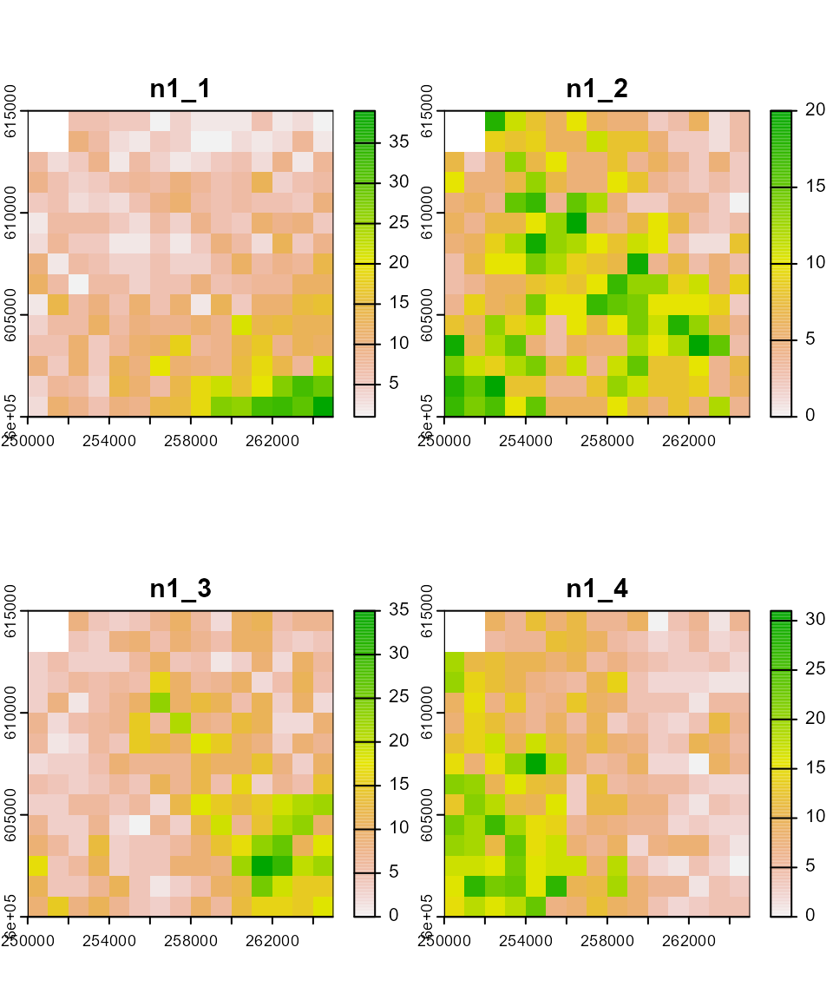
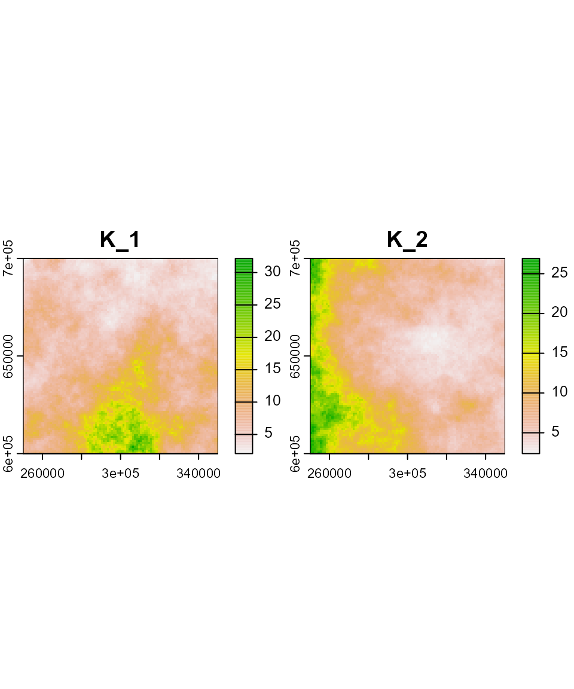
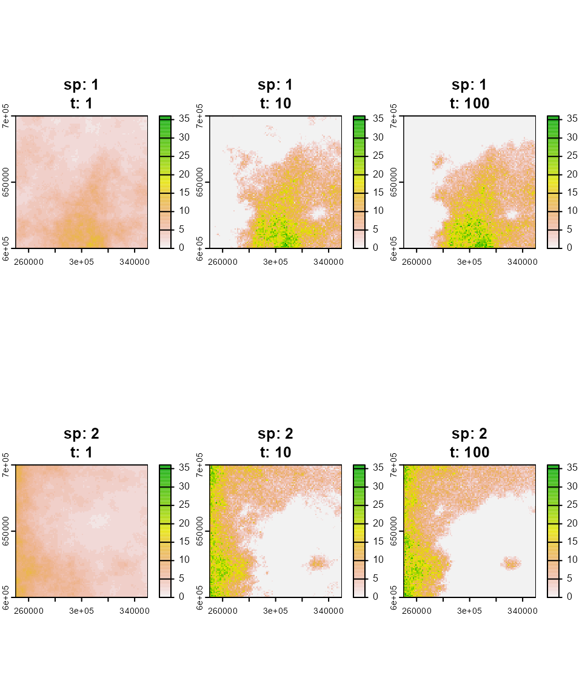
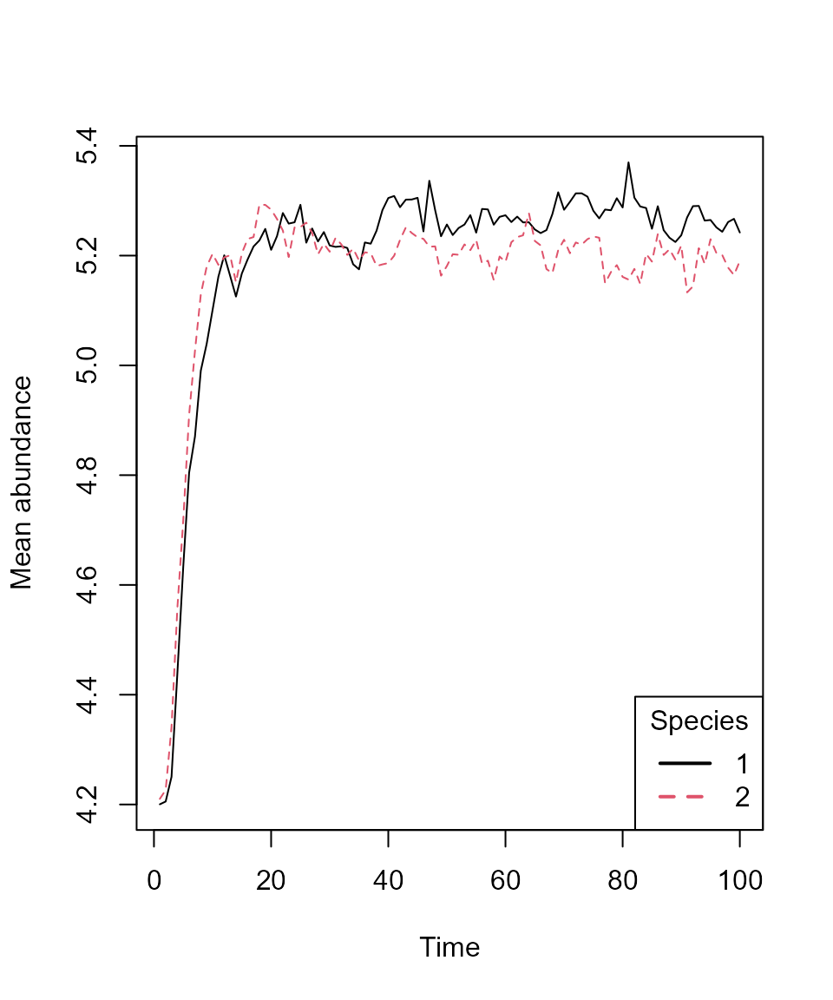

# How to use mrangr?

## About `mrangr`

This vignette demonstrates the main workflow of the `mrangr` package,
which is designed to simulate metacommunities within a **spatially
explicit, mechanistic framework**. The package builds upon the
functionality of the `rangr` package, which focused on simulating
single-species population dynamics with dispersal.

`mrangr` extends this by adding the ability to include **multiple
interacting species** via an **asymmetric interaction matrix**, allowing
for the flexible modelling of any type of biotic interaction.

## Basic workflow

This vignette shows how to:

1.  Create a virtual community.

2.  Run a simulation.

3.  Visualise results.

4.  Collect virtual ecologist data.

### Installing the package

The first step is to install and load the `mrangr` package.

You can install `mrangr` with:

``` r
devtools::install()
library(mrangr)
```

or using the “Install” button in “Build” tab in RStudio.

Since the maps on which the simulation takes place must be in the
`SpatRaster` format, we will also install and load the `terra` package
to make them easier to manipulate and visualise.

``` r
install.packages("terra")
library(terra)
```

### Input maps

One of the required inputs is a set of maps that specify the abundance
of each virtual species at the start of the simulation (`n1_map`), as
well as carrying capacity maps for all species in the community
(`K_map`). We have provided some examples of these in `mrangr`. You can
find more information about these datasets in the help files:

``` r
?K_map_eg.tif
?n1_map_eg.tif
```

Now, let’s load and plot these maps.

``` r
# Carrying capacity
K_map_eg <- rast(system.file("input_maps/K_map_eg.tif", package = "mrangr"))
plot(K_map_eg, main = paste0("K_", names(K_map_eg)))
```



``` r

# Initial abundance
n1_map_eg <- rast(system.file("input_maps/n1_map_eg.tif", package = "mrangr"))
plot(n1_map_eg ,main = paste0("n1_", names(n1_map_eg)))
```



Both of these rasters have **four** layers. This means that they are
ready for simulations involving **four** species, with each layer
representing either the carrying capacity or the initial abundance of a
species. **The order of the layers is crucial** and must be consistent
across all simulation parameters (e.g., species 1 corresponds to the
first layer in the input maps, the first row and column in the
interaction matrix, and so on).

To begin, the **input maps** are generated using the `K_sim` function,
which creates spatially autocorrelated rasters (e.g., representing
carrying capacity). Subsequent steps require the user to specify the
**number of species** and supply a **template raster** to define the
simulation’s spatial extent and resolution.

``` r
# define species number
nspec <- 2
# define map dimensions
nrows <- ncols <- 100

# prepare template raster
xmin <- 250000; xmax <- xmin + nrows * 1000
ymin <- 600000; ymax <- ymin + ncols * 1000
id <- rast(nrows = nrows, ncols = ncols, xmin = xmin, xmax = xmax, ymin = ymin, ymax = ymax)
crs(id) <- "epsg:2180"
id

# generate autocorrelated carrying capacity maps
K_map <- K_sim(n = nspec, id, range = 5e5, qfun = qlnorm, meanlog = 2, sdlog = 0.5)
```

We generated a raster with two layers. Each layer represents the
carrying capacity map for a given virtual species. In this example, the
carrying capacity maps were generated using a log-normal distribution;
however, any distribution can be used by specifying the appropriate
quantile function.

``` r
plot(K_map, main = paste0("K_", names(K_map)))
```



### Species interactions

The next step is to define the interspecific interactions, which in
`mrangr` is done using an **interaction matrix**. Each row and column of
the matrix represents a virtual species. Since we are using two species
in our example, the matrix is 2×2. The values within the matrix
represent the ***per-capita*** **interaction strength** of the species
in the **column** on the species in the **row**. This interaction is
ultimately realised as a change in the carrying capacity.

Here, we define a **symmetric competitive** interaction between two
species:

``` r
a <- matrix(c(NA, -0.8, -0.8, NA), nrow = nspec, ncol = nspec)
print(a)
#>      [,1] [,2]
#> [1,]   NA -0.8
#> [2,] -0.8   NA
```

### Community initialisation

Now that we have defined the carrying capacity maps and interactions, we
can use the `initialize_com` function to create the community. This
function returns an object of the class `sim_com_data`, which contains
all the necessary data for running a community simulation.

``` r
first_com <- initialise_com(
  n1_map = round(K_map / 2), 
  K_map = K_map, 
  r = 1.1, 
  a = a, 
  rate = 1 / 500)
```

In the previous sections, we prepared `a` and `K_map`, which we used to
define our first metacommunity. However, it was also necessary to pass
several **additional arguments**.

Here is a detailed breakdown of these:

- `n1_map` is a `SpatRaster` object specifying the **initial abundance**
  of species (in this example, set to half of the carrying capacity).
- The `r` parameter sets the population’s **intrinsic growth rate**. You
  may provide a unique value for each species or use a single value for
  all species, as in our case. The default population growth function is
  the **Gompertz function**.
- The `rate` parameter is linked to the `kernel_fun` parameter, which
  defaults to an exponential function (`rexp`). Consequently, `rate`
  determines the shape of the **dispersal kernel**, where the mean
  dispersal distance is *1/rate*. It is essential that this parameter is
  specified in the same units as the input maps. In our case, these are
  **metres**.

We can now use `summary` to take a closer look at the `first_com`
object.

``` r
summary(first_com)
#> Summary of sim_com_data object
#> 
#> Input maps (K_map and n1_map) summary by species:
#>  species n1_min n1_mean n1_max K_min K_mean K_max
#>        1      1    4.20     16  2.05   8.40 32.19
#>        2      1    4.21     13  2.38   8.43 26.93
#> 
#> Species-specific parameters:
#>  species   r r_sd K_sd A dens_dep kernel  kernel_args
#>        1 1.1    0    0 -      K2N "rexp" rate = 0.002
#>        2 1.1    0    0 -      K2N "rexp" rate = 0.002
#> 
#> Interaction matrix (a):
#>      1    2
#> 1   NA -0.8
#> 2 -0.8   NA
```

### Running the simulation

All you need to run a simulation is a `sim_com_data` object and the
**number of steps** you wish to simulate. Optionally, you can use the
**`burn`** parameter to discard the initial time steps, but we will omit
it for this example.

``` r
first_sim <- sim_com(first_com, time = 100)
```

Now, let’s examine the summary of the first simulation.

``` r
summary(first_sim)
#> Summary of sim_com_results object
#> 
#> Abundances summary: 
#>   species min q1 median mean q3 max
#> 1       1   0  0      3 5.20  9  45
#> 2       2   0  0      3 5.16  9  41
#> 
#> Simulated time steps:  100 
#> 
#> Extinction: 
#>     1     2 
#> FALSE FALSE
```

The summary reveals the following key information:

- The function `sim_com` returns an object of class `sim_com_results`.
- The mean abundance across species is relatively similar.
- The simulation was executed for 100 time steps.
- None of the species experienced extinction during the simulation.

### Visualisation

#### Over space

To take a closer look at the final step of the simulation, we will use
the [`plot()`](https://rspatial.github.io/terra/reference/plot.html)
function.

``` r
plot(first_sim, time = c(1, 10, 100))
```



The initial spatial distribution was set to be proportional to the
carrying capacity of each species’ habitat, effectively representing
their **fundamental niches**. Following the simulation, **competitive
exclusion** drove the species’ ranges to become almost entirely
separate. The resulting distribution maps illustrate the species’ final
**realised niches**.

#### Over time

We can also use the [`plot_series()`](../reference/plot_series.md)
function to plot the mean species abundances over all time steps.

``` r
plot_series(first_sim)
legend("bottomright", title = "Species", legend = 1:nspec, 
       lty = 1:nspec, lwd = 2, col = 1:nspec)
```



### Virtual ecologist

The final component in this basic workflow is the
[`virtual_ecologist()`](../reference/virtual_ecologist.md) function. It
serves to simulate the real-world observation process, allowing the user
to sample the simulated community abundances at defined points in space
and time. This step is crucial for incorporating the effects of sampling
effort and detection probability into the analysis.

``` r
ve <- virtual_ecologist(
  first_sim,
  type = "random_one_layer",
  prop = 1/100
)
head(ve)
#>     id      x      y species time n
#> 1 6323 272500 636500       1    1 4
#> 2 1363 312500 686500       1    1 2
#> 3 5253 302500 647500       1    1 5
#> 4 3214 263500 667500       1    1 4
#> 5 1079 328500 689500       1    1 2
#> 6 2268 317500 677500       1    1 2
```

For this demonstration, we used the sampling strategy
`type = "random_one_layer"`, meaning a random set of cells is sampled in
each time step. The `prop` argument controls the proportion of cells
sampled. Let’s inspect the structure of the resulting `data.frame`.

``` r
head(ve)
#>     id      x      y species time n
#> 1 6323 272500 636500       1    1 4
#> 2 1363 312500 686500       1    1 2
#> 3 5253 302500 647500       1    1 5
#> 4 3214 263500 667500       1    1 4
#> 5 1079 328500 689500       1    1 2
#> 6 2268 317500 677500       1    1 2
```

The output `data.frame` includes the following six columns:

- `id`: Unique cell identifier.
- `x`, `y`: Sampled cell coordinates.
- `species`: Species number or name.
- `time`: Sampled time step.
- `n`: Sampled abundance.

An alternative usage of
[`virtual_ecologist()`](../reference/virtual_ecologist.md) is to supply
a `data.frame` that pre-defines the sampling design, containing the
columns `"x"`, `"y"`, and `"time"`. This specifies the spatial and
temporal points of interest for observation.

## Summary

In this vignette, we demonstrated the key functionalities of the
`mrangr` package, specifically how to:

- Initialize a multi-species community using the
  [`initialise_com()`](../reference/initialise_com.md) function.
- Run spatially explicit simulations with
  [`sim_com()`](../reference/sim_com.md).
- Visualize outputs using
  [`plot()`](https://rspatial.github.io/terra/reference/plot.html) and
  track abundance changes over time with
  [`plot_series()`](../reference/plot_series.md).
- Generate simulated observation data (sampling) via the
  [`virtual_ecologist()`](../reference/virtual_ecologist.md) function.

Collectively, these tools establish `mrangr` as a powerful framework for
**mechanistic, spatially explicit metacommunity simulation**.
