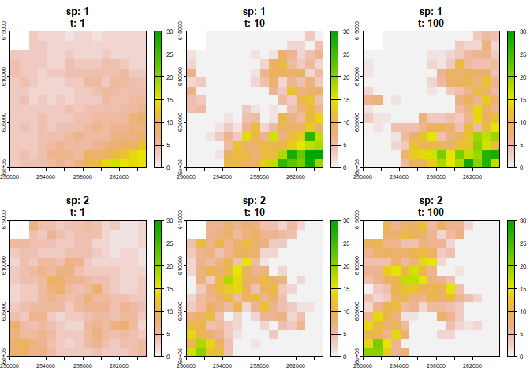
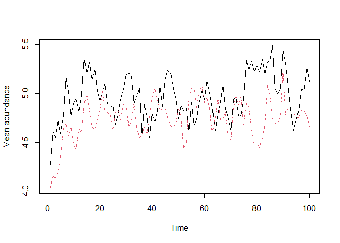

# mrangr

This package is a forward simulator designed to generate synthetic
metacommunity data. As an *in silico* experimental platform, it enables
researchers to computationally generate hypothetical community shifts,
test theoretical frameworks and benchmark analytical algorithms prior to
empirical application.

Core capabilities include:

- **Mechanistic simulation**: Generates spatially explicit community
  dynamics driven by local demography, dispersal, and interspecific
  interactions.
- **GIS interoperability**: Built on the `terra` ecosystem, the package
  reads and writes standard spatial formats (such as GeoTIFFs and ESRI
  grids), allowing simulations to run across dynamic environments.
- **Virtual ecologist module**: Bridges the gap between theory and
  empirical data by applying a hierarchical observation layer to the
  generated ground truth. Users can explicitly simulate imperfect
  detection and abundance estimation errors to mimic real-world
  biodiversity surveys.

## Installation

You can install **mrangr** with:

``` r

install.packages("mrangr")
```

## Basic Workflow

The `mrangr` workflow involves initialising a community with spatial
data and interaction parameters, running the simulation, and analysing
the results.

### 1. Input Maps and Interactions

You must provide carrying capacity maps (`K_map`) and initial abundance
maps (`n1_map`) as `SpatRaster` objects. For a community of $`N`$
species, the rasters must contain $`N`$ layers.

``` r

# Load example maps
K_map <- rast(system.file("input_maps/K_map_eg.tif", package = "mrangr"))
K_map <- subset(K_map, 1:2)
```

Interspecific interactions are defined using an **interaction matrix**
($`a`$), where values represent the per-capita interaction strength of
the species in the column on the species in the row.

``` r

# Example for 2 species with symmetric competition
nspec <- 2
a <- matrix(c(NA, -0.8, -0.8, NA), nrow = nspec, ncol = nspec)
```

### 2. Community Initialisation

Use
[`initialise_com()`](https://popecol.github.io/mrangr/reference/initialise_com.md)
to create a `sim_com_data` object. This stores all parameters, including
the intrinsic growth rate ($`r`$) and the dispersal rate.

``` r

first_com <- initialise_com(
  n1_map = round(K_map / 2), 
  K_map = K_map, 
  r = 1.1, 
  a = a, 
  rate = 1 / 500
)
```

### 3. Running the Simulation

The [`sim_com()`](https://popecol.github.io/mrangr/reference/sim_com.md)
function executes the simulation over a specified number of time steps.

``` r

first_sim <- sim_com(first_com, time = 100)
```

### 4. Visualisation

You can visualise the final spatial distributions or the change in mean
abundance over time.

``` r

# Visualise spatial niches at specific time steps
plot(first_sim, time = c(1, 10, 100))
```



``` r

# Plot abundance time series for all species
plot_series(first_sim)
```



## Virtual Ecologist

The package includes a
[`virtual_ecologist()`](https://popecol.github.io/mrangr/reference/virtual_ecologist.md)
function to simulate real-world observation processes. This allows users
to sample the simulated community at defined points in space and time,
incorporating sampling effort and detection probability into the
simulation.

## Citation

To cite **mrangr**, please use the
[`citation()`](https://rdrr.io/r/utils/citation.html) function:

``` r

library(mrangr)
citation("mrangr")
```

## Funding

This work was supported by the National Science Centre, Poland, grant
no. 2018/29/B/NZ8/00066 and the Poznań Supercomputing and Networking
Centre (grant no. pl0090-01).
